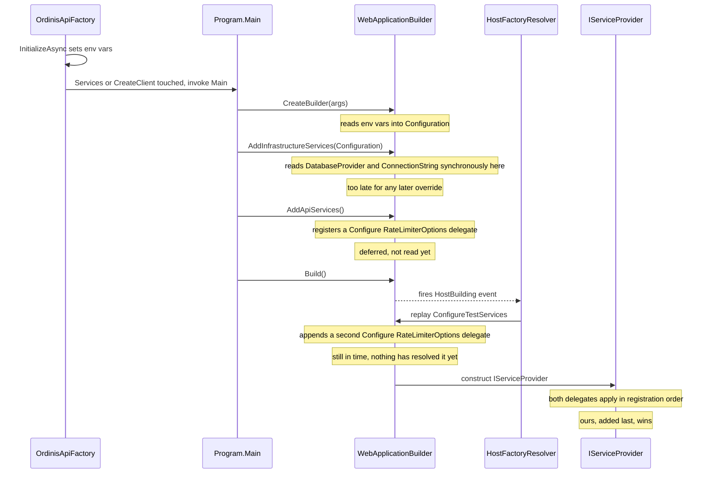
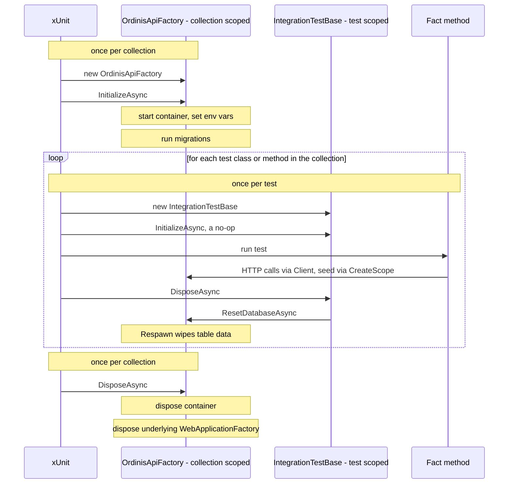
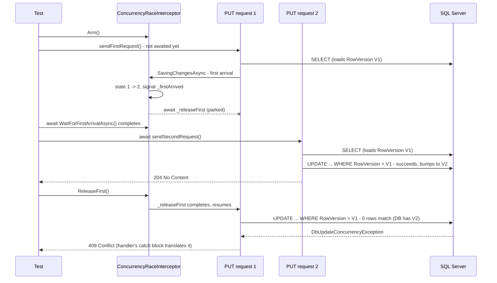
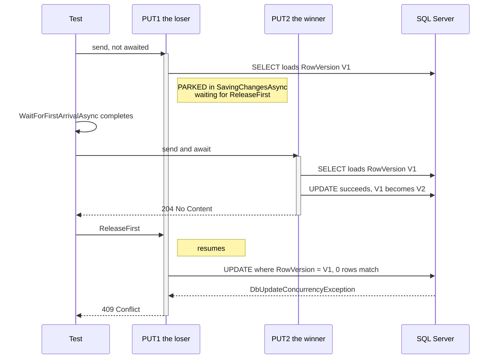

# Integration test infrastructure

`Ordinis.IntegrationTests` boots the real `Ordinis.Api` host in-process and drives it over HTTP
against a real, disposable SQL Server database — not mocks, not SQLite, not EF Core InMemory.
SQLite/InMemory were rejected because they can't faithfully exercise the `RowVersion`
concurrency-token and provider-specific SQL behavior these tests exist to catch.

```
tests/Ordinis.IntegrationTests/
├── Infrastructure/
│   ├── OrdinisApiFactory.cs     # WebApplicationFactory<Program> + SQL Server container lifecycle
│   ├── ApiCollection.cs         # xUnit collection definition — shares one factory across classes
│   └── IntegrationTestBase.cs   # base class every test class inherits from
└── SmokeTests.cs                # verifies the infra itself, not a feature
```

## Packages

| Package | Purpose |
|---|---|
| `Microsoft.AspNetCore.Mvc.Testing` | Provides `WebApplicationFactory<T>` — boots `Ordinis.Api` in-process and exposes an `HttpClient` wired directly to its `TestServer`, so requests never leave the process. |
| `Testcontainers.MsSql` | Starts/stops a disposable `mcr.microsoft.com/mssql/server:2022-latest` Docker container per test run. |
| `Respawn` | Resets table data (not schema) between tests by deleting rows in FK-safe dependency order — far cheaper than re-running migrations or recreating the database per test. |

Running these tests requires **Docker running locally** (and in CI).

## `OrdinisApiFactory`

A `WebApplicationFactory<Program>` that owns one `MsSqlContainer` for its whole lifetime.

- **`Program` visibility.** `Ordinis.Api/Program.cs` uses top-level statements, which don't
  otherwise expose an accessible entry-point type. `public partial class Program;` was added as
  the last line of `Program.cs` purely so `WebApplicationFactory<Program>` can reference it.

- **Config must be injected via environment variables, not `ConfigureWebHost`.**
  `Program.cs` calls `AddInfrastructureServices(builder.Configuration)`, which reads
  `DatabaseProvider` / `ConnectionStrings:DefaultConnection` **synchronously**, before
  `builder.Build()` runs. `WebApplicationFactory`'s `ConfigureWebHost` (and anything registered
  through it, like `ConfigureAppConfiguration`) only attaches once `Build()` is invoked — by then
  `AddInfrastructureServices` has already thrown for the missing connection string. Environment
  variables don't have this problem: `WebApplicationBuilder.CreateBuilder(args)` reads them at
  call time. So `OrdinisApiFactory.InitializeAsync()` sets
  `DatabaseProvider` / `ConnectionStrings__DefaultConnection` / `ASPNETCORE_ENVIRONMENT` as
  process environment variables **before** the host is ever built (i.e. before `Services` or
  `CreateClient()` is first touched).

- **Migrations run for real.** After the container starts, `InitializeAsync()` resolves
  `AppDbContext` from a DI scope and calls `Database.MigrateAsync()` — the same
  `Ordinis.Infrastructure.Migrations.SqlServer` migrations production uses (see
  [MIGRATIONS.md](MIGRATIONS.md)). There is deliberately no `EnsureCreated()` shortcut, so a
  migration that doesn't apply cleanly fails the test run the same way it would fail a real
  deployment.

- **The global rate limiter is disabled for tests.** Production applies a 100 requests/minute
  fixed-window limiter partitioned by client IP (`src/Ordinis.Api/Common/ApiServiceExtensions.cs`).
  Every request from `WebApplicationFactory`'s in-process `TestServer` client shares the same
  loopback partition key, so a test suite firing more than 100 requests in a minute would start
  getting spurious `429`s. `ConfigureTestServices` overrides `RateLimiterOptions.GlobalLimiter` to
  `null` for this factory. A dedicated rate-limiting test (still on the BUILD_PLAN checklist)
  should build its own factory/limiter config instead of relying on this shared instance.

- **`ResetDatabaseAsync()`** wipes table data via Respawn. The `Respawner` is created lazily on
  first use and cached — building it involves introspecting the schema's foreign-key graph to
  compute a safe delete order, so it's done once per factory instance, not once per reset.

## When `ConfigureWebHost` actually runs

`ConfigureWebHost` doesn't run before or after `Program.cs` — it runs **inside** `Program.cs`'s
own call to `builder.Build()`. Understanding the exact timing explains why `ConfigureTestServices`
can override the rate limiter but `ConfigureAppConfiguration` can't fix the connection string.

`WebApplicationFactory<Program>` doesn't execute `Program.cs` as a black box. It invokes
`Program.Main(args)` via reflection (`HostFactoryResolver`), but with a `DiagnosticListener`
subscribed beforehand. `WebApplicationBuilder.Build()` fires a `"HostBuilding"` diagnostic event
partway through its own execution — at that moment, the listener hands the in-progress host
builder to `WebApplicationFactory`, which replays every customization queued via `ConfigureWebHost`
(`ConfigureAppConfiguration`, `ConfigureServices`, `ConfigureTestServices`, ...) against it. Only
after that does `Build()` proceed to construct the actual `IServiceProvider`.



Concretely, the first time `Services` or `CreateClient()` is touched on this factory:

1. `OrdinisApiFactory.InitializeAsync()` sets the environment variables, *then* touches `Services`
   for the first time — that access is what triggers step 2.
2. `Program.Main` starts executing: `WebApplication.CreateBuilder(args)` reads those env vars into
   `builder.Configuration`.
3. `builder.Services.AddInfrastructureServices(builder.Configuration)` runs — reads
   `DatabaseProvider` / the connection string **synchronously, right now** — and
   `AddApiServices()` registers the rate limiter's `Configure<RateLimiterOptions>` delegate. Both
   are just top-level statements executing top-to-bottom like any other code.
4. `builder.Build()` is called. **This is where `ConfigureWebHost` actually runs** — the
   `"HostBuilding"` event fires, and this factory's `ConfigureTestServices` block appends *another*
   `Configure<RateLimiterOptions>` registration to the still-open `IServiceCollection`.
5. `Build()` finishes constructing the `IServiceProvider`. Multiple `IConfigureOptions<T>`
   registrations for the same options type apply in registration order, so the one added last —
   ours — wins and zeroes out `GlobalLimiter`.

**Why this works for the rate limiter but not the connection string:** `Configure<RateLimiterOptions>`
doesn't *do* anything at registration time — it's added to a list replayed later, whenever
something actually resolves `IOptions<RateLimiterOptions>` (on the first request), which is well
after `Build()` completes. Appending one more delegate during step 4 is still plenty early.

`AddInfrastructureServices` doesn't register a deferred `Configure<T>` for the connection string —
it *reads* `configuration["DatabaseProvider"]` and throws immediately, in step 3, before `Build()`
(step 4) even starts. By the time `ConfigureWebHost` gets a chance to run, that line has already
executed and thrown. `ConfigureAppConfiguration` couldn't have fixed this regardless of what it
changed, because it's a step-4 mechanism trying to fix a step-3 problem — which is exactly why
connection info goes through environment variables in step 1, before `Program.Main` even starts,
instead.

**Rule of thumb:** anything Program.cs *reads eagerly* (a plain `configuration[...]` lookup used
immediately, like `AddDatabase`'s validation) must be supplied via environment variables before the
factory is first touched. Anything Program.cs merely *registers* for later resolution (an
`options.Configure<T>` delegate, most DI registrations) can still be overridden through
`ConfigureWebHost`, because DI registrations aren't consumed until something resolves them, and
that always happens after `Build()`.

## Fixture lifecycle

Nothing in this project calls `InitializeAsync()`/`DisposeAsync()` directly — xUnit calls them
automatically as part of its collection-fixture protocol. There are two independent
`IAsyncLifetime` cycles running at different scopes — one around the whole collection, one around
each individual test:



1. Before running the first test in the `"Ordinis API"` collection, xUnit constructs one
   `OrdinisApiFactory` via its parameterless constructor (required by `ICollectionFixture<T>`).
2. Because `OrdinisApiFactory` implements `IAsyncLifetime`, xUnit immediately awaits
   `InitializeAsync()` on it — this is what starts the container, sets the environment variables,
   and runs migrations, all before any test executes.
3. That one initialized instance is injected into every test class constructor tagged
   `[Collection(ApiCollection.Name)]` (i.e. `IntegrationTestBase(OrdinisApiFactory factory)`, and
   transitively every subclass such as `SmokeTests(OrdinisApiFactory factory)`).
4. Each individual test also gets its own `IAsyncLifetime` cycle at the *test* level:
   `IntegrationTestBase.InitializeAsync()` is a no-op, and `DisposeAsync()` calls
   `Factory.ResetDatabaseAsync()` — so xUnit resets the database after every single test, not just
   once per class.
5. After the last test in the collection finishes, xUnit calls `OrdinisApiFactory`'s explicit
   `IAsyncLifetime.DisposeAsync()` once, which disposes the container and the underlying
   `WebApplicationFactory`.

So there are two independent `IAsyncLifetime` implementations in play at different scopes:
`OrdinisApiFactory` (collection-scoped, runs once) and `IntegrationTestBase` (test-scoped, runs
per test). `SmokeTests.cs` exists purely to exercise this whole chain end-to-end — container boot,
migrations, an HTTP round-trip, and the rate-limiter override — as a regression check on the
infrastructure itself, independent of any real feature test.

## `ApiCollection`

```csharp
[CollectionDefinition(Name)]
public sealed class ApiCollection : ICollectionFixture<OrdinisApiFactory>
```

Pure xUnit wiring — no test logic. `ICollectionFixture<OrdinisApiFactory>` tells xUnit to
construct exactly one `OrdinisApiFactory` and hand that same instance to every test class tagged
`[Collection(ApiCollection.Name)]`. This exists because container startup + migrations take
several seconds; without it, every test *class* would pay that cost separately.

Side effect that matters: xUnit runs test *collections* in parallel with each other, but classes
*within* one collection run sequentially. Since every integration test class shares this one
collection, tests never run concurrently against the shared, resettable database — which matters
because `IntegrationTestBase.DisposeAsync()` resets that database after each test.

## `IntegrationTestBase`

The base class every integration test class inherits from:

```csharp
[Collection(ApiCollection.Name)]
public abstract class IntegrationTestBase(OrdinisApiFactory factory) : IAsyncLifetime
```

- `Client` — an `HttpClient` from the shared factory, ready to call.
- `CreateScope()` — opens a DI scope for seeding data directly via `AppDbContext` before a request
  is made.
- `DisposeAsync()` calls `Factory.ResetDatabaseAsync()` after every test, so tests stay independent
  regardless of execution order.

## Testing optimistic-concurrency conflicts deterministically

`TasksController.Update`, `OrganizationsController.Update`, `ProjectsController.Update`,
`BoardsController.RenameBoard`, `UsersController.UpdateUser`, and `UsersController.ChangeOrgRole`
all document a `409 Conflict` response and catch `DbUpdateConcurrencyException` in their handlers
(the CLAUDE.md-mandated `RowVersion` + `DbUpdateConcurrencyException → 409` pattern). Proving that
contract from an integration test turned out to be the hardest test-infra problem in this suite,
because of one fact: **as of this writing, this API has no ETag/If-Match mechanism wired at the
HTTP layer.** That's not an oversight — it's still-pending work tracked as its own item on
BUILD_PLAN.md's Phase 7 checklist (`TaskDto.ConcurrencyToken` as an `ETag` response header,
`If-Match`-required `PUT`/state-transition endpoints, a `ConcurrencyTokenMiddleware` to decode it —
see BUILD_PLAN.md:851-854). Until that phase lands, a client can never *deliberately* trigger a 409
by supplying a stale version header — the only way to ever observe a genuine 409 today is a true
race, where two requests both load the same `RowVersion` before either one saves. **Once Phase 7
ships, these tests should be revisited** — a real `If-Match` header would let a test trigger a 409
directly (send a known-stale token) instead of needing to force a race at all, which would make
this whole interceptor mechanism unnecessary for coverage purposes (though it may still be useful
for testing the true-race edge case specifically).

### Why racing real HTTP requests was rejected

The first approach fired two concurrent `PUT` requests via `Task.WhenAll` against the real SQL
Server Testcontainer and relied on their SELECT/UPDATE round trips genuinely overlapping — real
network/DB latency was the only thing creating the race window. This worked reliably for 5 of the
6 target endpoints across repeated runs. `BoardsController.RenameBoard`'s version of the test,
though, passed 4/4 in isolation but failed 3/3 when run alongside the other five concurrency tests
in one batch (`Actual: [NoContent, NoContent]` — no race occurred, both requests completed
sequentially without overlapping). The failure was 100% reproducible in that specific
isolation-vs-batch split, which rules out one-off flakiness: something about batch execution
context (thread pool/connection pool "warmth" after several prior tests have already run in the
same shared `ApiCollection`/factory) reliably closes the race window for this one test, even
though the underlying concurrency-handling code was never in question — it was already proven
correct by unit tests and by the other five tests passing repeatedly.

Retrying the race a bounded number of times would have reduced the failure rate, but every attempt
would still be a coin flip against real timing — not a fix, just fewer visible failures. The right
fix was to stop depending on timing at all.

### The mechanism: `ConcurrencyRaceInterceptor`

`ConcurrencyRaceInterceptor` (`Infrastructure/ConcurrencyRaceInterceptor.cs`) is a test-only
`Microsoft.EntityFrameworkCore.Diagnostics.SaveChangesInterceptor`, registered as a DI singleton in
`OrdinisApiFactory.ConfigureTestServices`:

```csharp
services.AddSingleton<ConcurrencyRaceInterceptor>();
services.AddDbContext<AppDbContext>((sp, options) =>
    options.AddInterceptors(sp.GetRequiredService<ConcurrencyRaceInterceptor>()));
```

Merely registering `ConcurrencyRaceInterceptor` as a DI service is **not** enough — EF Core does
not auto-attach interceptors just because they exist somewhere in the application's `IServiceCollection`
(this was confirmed the hard way: an earlier version of this registration compiled fine, resolved
fine, but the interceptor's `SavingChangesAsync` was simply never invoked, and the affected test
hung forever waiting on a signal that would never come — see "Why a bounded wait, not an unbounded
one" below). `AddInterceptors(...)` must be called explicitly on the `DbContextOptionsBuilder`.
Since `AppDbContext` is already registered once via `AddDbContext` in
`InfrastructureServiceExtensions.AddDatabase`
(`src/Ordinis.Infrastructure/Common/InfrastructureServiceExtensions.cs`), this test-side
`AddDbContext<AppDbContext>` call is a **second** registration — EF Core composes multiple
`IDbContextOptionsConfiguration<TContext>` registrations for the same context type rather than one
replacing the other (the same layering pattern already used one call above for
`Configure<RateLimiterOptions>`), so this purely *adds* the interceptor on top of the SQL Server
options already configured in production code. No production code changes were needed — this
mechanism lives entirely in `OrdinisApiFactory`. It works because
`AppDbContext.SaveChangesAsync` (`src/Ordinis.Infrastructure/Persistence/AppDbContext.cs:101`) sets
audit timestamps and drains the outbox, then delegates to `base.SaveChangesAsync`, which is what
actually invokes the interceptor pipeline — so the interceptor sees every real save a `PUT` request
triggers, with no special-casing needed for the outbox or timestamp logic layered on top.

The interceptor is a one-shot gate, armed per race:

```csharp
public sealed class ConcurrencyRaceInterceptor : SaveChangesInterceptor
{
    private TaskCompletionSource? _firstArrived;
    private TaskCompletionSource? _releaseFirst;
    private int _state; // 0 = disarmed, 1 = armed, 2 = first arrival consumed

    public void Arm() { /* resets both TaskCompletionSources, sets _state = 1 */ }
    public Task WaitForFirstArrivalAsync() => _firstArrived!.Task;
    public void ReleaseFirst() => _releaseFirst!.SetResult();

    public override async ValueTask<InterceptionResult<int>> SavingChangesAsync(
        DbContextEventData eventData, InterceptionResult<int> result, CancellationToken cancellationToken = default)
    {
        if (Interlocked.CompareExchange(ref _state, 2, 1) == 1)
        {
            _firstArrived!.SetResult();
            await _releaseFirst!.Task;   // parked here until the test calls ReleaseFirst()
        }

        return await base.SavingChangesAsync(eventData, result, cancellationToken);
    }
}
```

`Interlocked.CompareExchange(ref _state, 2, 1)` is what makes this a *one-shot* gate: only the
first `SaveChangesAsync` call to reach it after `Arm()` sees `_state == 1` and gets parked; every
later call (state already `2`) falls straight through to `base.SavingChangesAsync` untouched. This
is what lets the second request in a race proceed completely normally.

`IntegrationTestBase.AssertConcurrentRequestsConflictAsync` drives the whole sequence:

```csharp
protected async Task AssertConcurrentRequestsConflictAsync(
    Func<Task<HttpResponseMessage>> sendFirstRequest,
    Func<Task<HttpResponseMessage>> sendSecondRequest)
{
    ConcurrencyRaceInterceptor interceptor = Factory.Services.GetRequiredService<ConcurrencyRaceInterceptor>();
    interceptor.Arm();

    Task<HttpResponseMessage> firstResponseTask = sendFirstRequest();
    await interceptor.WaitForFirstArrivalAsync().WaitAsync(TimeSpan.FromSeconds(15));

    HttpResponseMessage secondResponse = await sendSecondRequest().WaitAsync(TimeSpan.FromSeconds(15));
    interceptor.ReleaseFirst();
    HttpResponseMessage firstResponse = await firstResponseTask.WaitAsync(TimeSpan.FromSeconds(15));

    Assert.Equal(HttpStatusCode.Conflict, firstResponse.StatusCode);
    Assert.Equal(HttpStatusCode.NoContent, secondResponse.StatusCode);
}
```

**Why a bounded wait, not an unbounded one.** Every `await` in this method is wrapped in
`.WaitAsync(TimeSpan.FromSeconds(15))`. This isn't defensive boilerplate — it's there because of a
real failure mode hit while building this mechanism: an earlier version of the interceptor
registration (see the callout above — registering `ConcurrencyRaceInterceptor` as a plain DI
service instead of via `AddInterceptors(...)`) compiled and resolved without error, but the
interceptor was never actually attached to `AppDbContext`. The request ran straight through,
`_firstArrived` never completed, and `await interceptor.WaitForFirstArrivalAsync()` — unbounded at
the time — hung the test (and the whole `dotnet test` process) indefinitely, with no exception, no
timeout, and no output. A 15-second bound turns that class of regression back into an immediate,
diagnosable test failure instead of a silent hang that has to be killed by hand.



The sequence diagram above shows *what* messages happen in *what order*, but not *how long* each
side is actually running versus sitting parked — which is the part that makes this deterministic
rather than a race. This timeline makes that explicit: PUT1 spends most of the test blocked inside
`SavingChangesAsync`, doing nothing, while PUT2 runs its entire load-modify-save cycle to
completion in that window; PUT1 only resumes, and fails, after PUT2 is already done.



The `activate`/`deactivate` bars are the key thing to read here: PUT1's bar spans the entire
diagram top to bottom, while PUT2's bar is short and sits fully nested inside it. That containment
is the whole mechanism, drawn directly rather than described:

- **PUT1 is parked, not racing.** From the moment it reaches `SavingChangesAsync` until
  `ReleaseFirst` is called, PUT1 does nothing — it isn't retrying, isn't polling, isn't competing
  with PUT2 for anything. It's mechanically incapable of touching the database again until the test
  says so.
- **PUT2's entire life cycle happens inside that idle window.** PUT2 is not even sent until
  `await WaitForFirstArrivalAsync()` returns — that's what enforces the gap. There's no window
  where both requests are genuinely racing each other in real time: PUT2's entire life cycle
  happens strictly *after* PUT1 has already committed to becoming stale, and strictly *before*
  PUT1 is allowed to try again.

Because request 1 loaded the entity (capturing `RowVersion` V1 in its change tracker's
`OriginalValues`) *before* it was parked, and request 2 fully completes its own load-modify-save
cycle while request 1 is paused, request 1's UPDATE is guaranteed to run against data that has
already moved on by the time it's released — a real `DbUpdateConcurrencyException`, not a
simulated one. The existing handler catch block (present in every `Update`-style handler per
CLAUDE.md's concurrency convention) is exercised exactly as it would be in production.

### Why a shared singleton interceptor is safe here

`ConcurrencyRaceInterceptor` is one instance shared by every `AppDbContext` for the lifetime of the
factory — but that's safe because `ApiCollection` (see above) already guarantees test *classes*
within the shared collection run sequentially, never concurrently, against the same shared
database. Only one test ever has the gate armed at a time, and each test re-arms it fresh via
`Arm()`, so there's no risk of two unrelated tests' save calls colliding on the same barrier.

### Why this is deterministic where `Task.WhenAll` wasn't

No step in this sequence depends on wall-clock timing or network/DB latency. Request 2 is not even
*started* until the test has confirmed — via the awaited `_firstArrived` `TaskCompletionSource` —
that request 1's save is already parked immediately before its UPDATE. The interleaving is enforced
by explicit signaling between the test and the interceptor, not by hoping two independently-timed
async operations happen to overlap. This is why it passes identically whether `BoardsControllerTests`
runs alone or as part of the full batch — the isolation-vs-batch distinction that broke the
`Task.WhenAll` version doesn't exist here, because there's no longer anything for batch-vs-solo
timing differences to affect.

### Coverage: all 19 endpoints that can conflict, and why `ProjectMember` mutations needed a real fix

The original 6 concurrency tests covered every documented `Update`-style action. A follow-up audit
of every mutating endpoint (Controllers + Minimal APIs) found 13 more that load and save a
`RowVersion`-tracked aggregate but had no `catch (DbUpdateConcurrencyException)` at all —
`TasksController.Delete`; `ProjectsController.Delete`/`Archive`/`Unarchive`/`AddMember`/
`ChangeMemberRole`/`RemoveMember`; `BoardsController.ArchiveBoard`/`UnarchiveBoard`;
`OrganizationsController.Suspend`/`Reactivate`; `UsersController.DeactivateUser`/`ReactivateUser`.
CLAUDE.md makes catching this exception a hard rule, not a nice-to-have, so a real conflict on any
of these would have surfaced as an unhandled `500`, not the documented `409`. All 13 got the same
catch-and-translate pattern as the original 6, plus a `_ConcurrentModification_Returns409` test
each, using the exact same `AssertConcurrentRequestsConflictAsync` mechanism described above — 19
concurrency tests total.

Most of the 13 new tests pair two *identical* requests (e.g. `ArchiveBoard_ConcurrentModification_Returns409`
fires the same `POST /archive` twice) rather than two different mutations like the `Update` tests
do. This isn't arbitrary: several of these aggregates reject *any* other mutation while in the
in-between state the losing request is parked in - e.g. `Project.Rename`/`UpdateDescription`/
`AddMember`/etc. all call `EnsureNotArchived()`, so while an `Unarchive` request is parked (the
database still shows the project as archived, since the parked request's own save hasn't landed),
a second request trying to `Update` the same project would itself fail with `422`, not the `204`
the helper expects from the "winner." Firing the *same* action twice sidesteps this entirely: the
second call sees the pre-conflict state (still archived) and satisfies whatever precondition that
state implies, succeeds normally, and only then does releasing the first one produce the genuine
stale-`RowVersion` conflict. (`ProjectsController.Unarchive`'s test is the one exception - it pairs
with `Delete`, since `Project.SoftDelete` is the one mutation that does *not* call
`EnsureNotArchived()`.)

**A real, structural bug surfaced while writing these tests, not a test-writing mistake.** The new
`AddMember_ConcurrentModification_Returns409` test initially failed with *both* requests returning
success - no conflict at all, even with the catch block correctly in place. The reason:
`ProjectMember` (`src/Ordinis.Infrastructure/Projects/ProjectMemberConfiguration.cs`) maps to its
own `ProjectMembers` table with no `RowVersion` of its own - it's owned by `Project` in the DDD
sense (created and removed only through `Project.AddMember`/`RemoveMember`), but not EF-Core-owned
or embedded in the same table. Adding, changing, or removing a `ProjectMember` therefore only ever
produces an `INSERT`/`UPDATE`/`DELETE` against `ProjectMembers` - `Project`'s own row is never
included in the `UPDATE` batch, because `AppDbContext.SetConcurrencyTokens()` only reassigns
`RowVersion` for a tracked `AggregateRoot` whose own `EntityState` is `Added`/`Modified`, and
`Project` stays `Unchanged` when only a child row changes. There was structurally nothing for
`DbUpdateConcurrencyException` to ever detect, no matter how the two requests were timed.

The fix is infrastructure-level, not per-handler, since the aggregate root is the DDD consistency
boundary - any child mutation is conceptually an aggregate mutation, and re-deriving that fact by
hand in every handler that touches a child table would be exactly the kind of scattered, easy-to-
forget logic this project avoids. `AppDbContext.MarkAggregateRootsDirtyForChangedChildren()`
(called from `SetConcurrencyTokens()`, before token assignment) walks every changed non-root
tracked entry and, for each navigation whose *inverse* is a collection on an aggregate root (the
signal that distinguishes real ownership - `ProjectMember.Project`, whose inverse `Project.Members`
is a collection, from an unrelated reference like `ProjectMember.User`, which has no such inverse
since `User.ProjectMemberships` was deliberately removed earlier in this project - see the
aggregate-references row in CLAUDE.md's design-decision table), resolves the owning aggregate root
and marks it `Modified` if it's still `Unchanged`.

That resolution has to go through foreign-key **values**, not navigation fixup
(`ReferenceEntry.TargetEntry`) - a second failure while building this (`RemoveMember_ConcurrentModification_Returns409`,
this time correctly detecting the missing-cascade bug but for a different underlying reason) showed
that `TargetEntry` is always `null` once an entity is marked `Deleted`, because EF Core severs the
navigation fixup at that point. The FK property values, by contrast, remain readable on the entry
until the `DELETE` command actually executes, so resolving the owner by matching FK values against
tracked `AggregateRoot` entries' primary-key values works uniformly across `Added`, `Modified`, and
`Deleted` children.

This fix isn't just about making the new tests pass - it closes a real invariant-violation window.
`Project.RemoveMember`'s domain guard blocks removing the last remaining Admin, but that guard only
checks the aggregate's state *as loaded*, not as it is at the moment of write. Without the
aggregate-level `RowVersion` bump, two concurrent removals of two *different* Admins can each pass
the guard independently:

1. Project has two Admins, Alice and Bob.
2. Request A: `RemoveMember(Bob)` loads the project, sees `{Alice: Admin, Bob: Admin}`, the guard
   passes ("Alice remains"), and it proceeds.
3. Request B (concurrent): `RemoveMember(Alice)` loads the project *independently*, also sees
   `{Alice: Admin, Bob: Admin}` (A hasn't committed yet), the guard passes ("Bob remains"), and it
   proceeds.
4. Both saves succeed - zero Admins remain. The invariant is violated, and neither guard ever saw
   anything wrong, because each was checking a snapshot that was true when read but stale by the
   time it was acted on - a classic time-of-check-to-time-of-use race.

With the cascade fix in place, request B's save fails with `409` (`Project`'s `RowVersion` was
already bumped by A's commit), forcing a reload - at which point the guard correctly sees only
Alice remaining and blocks the removal. Domain guards and optimistic concurrency are complementary,
not redundant: the guard enforces that the invariant is true *at the moment of the check*;
`RowVersion` ensures that moment is still valid *at the moment of the write*.

This fix is general rather than `ProjectMember`-specific: it will automatically protect any future
aggregate/child-table pair that follows the same "owned child in its own table, referenced by a
collection navigation" shape, with no further changes needed anywhere else.

**Known limitations, not currently exercised by this domain model.** The fix's ownership signal -
`navigation.Inverse is { IsCollection: true }` - and its single-pass walk both make assumptions that
hold for every owned child in this codebase today (`ProjectMember`, `Comment`, `Attachment`: all
one level deep, all one-to-many), but wouldn't generalize automatically if either assumption stopped
holding:

- **A one-to-one owned child would not cascade.** The "inverse is a collection" check is what
  distinguishes a real ownership relationship (`ProjectMember.Project`, whose inverse
  `Project.Members` is a collection) from an unrelated reference (`ProjectMember.User`, which has no
  such inverse). In a 1:1 relationship (e.g. a hypothetical `Project.Settings` ↔
  `ProjectSettings.Project`), the inverse on the owner side is *also* a plain reference, not a
  collection - so the current check would treat a genuinely owned 1:1 child exactly like an
  unrelated reference and silently skip it. A bare FK shape can't distinguish "1:1 owned child" from
  "1:1 reference to an unrelated aggregate" on its own; closing this gap would need an extra signal
  (e.g. EF Core's `OwnsOne`, if adopted, or an explicit project convention/marker).

- **A multi-level hierarchy (root → child → grandchild) only cascades reliably one hop, and even
  that hop depends on enumeration order.** `MarkAggregateRootsDirtyForChangedChildren` takes a
  single snapshot of `ChangeTracker.Entries()` and makes one pass over it. If a grandchild changes,
  the method correctly marks its immediate parent `Modified` - but whether that newly-`Modified`
  parent then gets its *own* turn to cascade further up to the root depends on where the parent's
  entry happened to land in that same enumeration snapshot relative to the grandchild's. If the
  parent was enumerated first, it was still `Unchanged` at that point, was skipped, and never gets
  revisited - the cascade silently stops one level short of the root. Fixing this properly means
  walking the ownership chain iteratively from each changed entry - following "owner via FK"
  repeatedly until landing on an actual `AggregateRoot` - rather than relying on a single pass over
  a snapshot; that would be deterministic regardless of hierarchy depth or enumeration order, and is
  a comparatively small change if this domain ever grows a grandchild relationship.

## Writing a new integration test class

```csharp
public sealed class TasksControllerTests(OrdinisApiFactory factory) : IntegrationTestBase(factory)
{
    [Fact]
    public async Task CreateTask_ValidPayload_Returns201()
    {
        // seed via CreateScope() if the test needs existing data, then:
        HttpResponseMessage response = await Client.PostAsJsonAsync("/api/v1/tasks", request);
        Assert.Equal(HttpStatusCode.Created, response.StatusCode);
    }
}
```

No further setup is required — the constructor picks up the shared factory automatically via
xUnit's collection fixture injection.

### Seeding prerequisite data via `CreateScope()`

Most endpoints need rows that already exist — `POST /api/v1/tasks` needs a valid `BoardId`
(and usually a `ReporterId`), so "create a task" can't be tested in isolation. There's no shared
baseline data (deliberately deferred — see `ApiCollection`/`IntegrationTestBase`'s BUILD_PLAN
notes), so each test seeds its own prerequisites directly via EF Core, through `CreateScope()`,
rather than going through other endpoints (e.g. `POST /api/v1/boards`) just to obtain IDs — that
would be slower and would couple this test's correctness to an unrelated endpoint's.

```csharp
[Fact]
public async Task CreateTask_ValidPayload_Returns201()
{
    Guid boardId;
    using (IServiceScope scope = CreateScope())
    {
        AppDbContext db = scope.ServiceProvider.GetRequiredService<AppDbContext>();
        Board board = Board.Create(Guid.CreateVersion7(), projectId, "Sprint Board", createdByUserId, now);
        db.Boards.Add(board);
        await db.SaveChangesAsync();
        boardId = board.Id;
    }

    var request = new CreateTaskRequest { BoardId = boardId, Title = "Fix login bug" };
    HttpResponseMessage response = await Client.PostAsJsonAsync("/api/v1/tasks", request);

    Assert.Equal(HttpStatusCode.Created, response.StatusCode);
}
```

The seeding scope must be disposed (`SaveChangesAsync` called, then the `using` block exited)
**before** the HTTP call — `AppDbContext` is scoped per DI scope, so the controller's own request
pipeline resolves a *separate* `AppDbContext` instance to serve the HTTP call. Only rows already
committed via `SaveChangesAsync` are visible to it.

## Where uploaded attachment files land during tests

`POST /api/v1/tasks/{id}/attachments` (tested in `TasksControllerTests.AddAttachment_*`) writes a
real file to disk via `LocalFileStorageService`, not just a database row. During a test run those
files land at:

```text
tests/Ordinis.IntegrationTests/bin/Debug/net10.0/wwwroot/attachments/
```

not under `src/Ordinis.Api/`, which is easy to assume incorrectly since that's where the app's own
`wwwroot/attachments` folder lives in production.

**Why:** `LocalFileStorageService.UploadAsync` (`src/Ordinis.Infrastructure/FileStorage/LocalFileStorageService.cs`)
combines `_options.BasePath` directly into a file path with no content-root resolution:

```csharp
var directory = _options.BasePath;          // "wwwroot/attachments" - relative, from appsettings.json
var fullPath = Path.Combine(directory, storedFileName);
```

A relative path like that resolves against `Environment.CurrentDirectory` — the process's current
working directory — not `IWebHostEnvironment.ContentRootPath`. `WebApplicationFactory<Program>`
boots the API host in-process *inside the test process*; it doesn't change that process's working
directory to match `Ordinis.Api`'s own folder. So `Environment.CurrentDirectory` during a test run
is wherever `dotnet test` itself runs from — the **test assembly's** build output directory — and
`wwwroot/attachments` gets created underneath that instead.

**Cleanup is best-effort, not guaranteed.** `ResetDatabaseAsync` (Respawn) only resets the
*database* between tests — it has no idea these files exist and never touches the file system.
`AddAttachment_ValidFile_Returns201WithDownloadUrl` calls a cleanup `DELETE` at the end of the test
itself to remove the file it created, but that's inside the test body, not a fixture-level
guarantee: a test that fails an assertion *before* reaching that `DELETE` call, or is interrupted,
leaves its file behind. In practice this means the `wwwroot/attachments` folder under the test
project's `bin/` output can accumulate stray files across local runs — harmless (regenerated on
`dotnet clean`/rebuild, and `bin/` isn't committed), but worth knowing about if you're wondering
why files show up there that no test currently references.

`RemoveAttachment_*` tests avoid this entirely by seeding attachments directly via
`ProjectTask.AddAttachment(...)` through `CreateScope()` with a fake `storageUrl` that points at no
real file (see `SeedAttachmentAsync` in `TasksControllerTests.cs`) — `LocalFileStorageService.DeleteAsync`
logs a warning and no-ops when the file it's asked to delete doesn't exist, rather than throwing,
so this works without ever writing a real file to disk for those tests.
