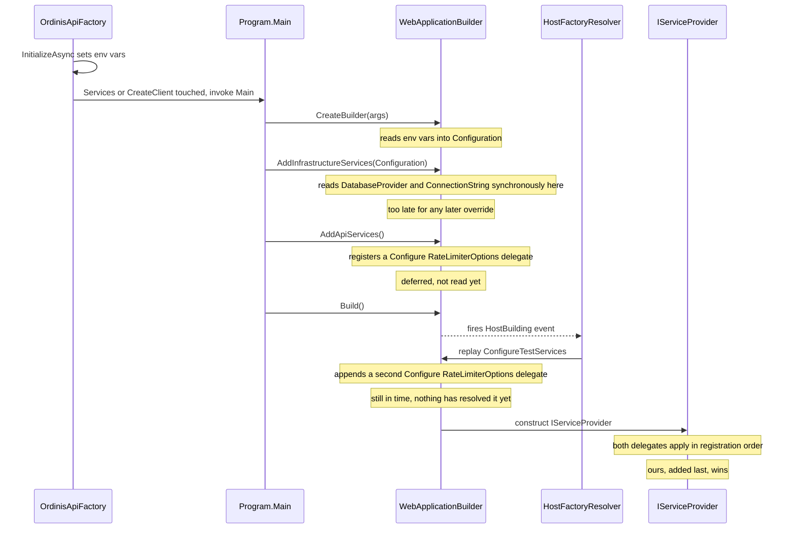
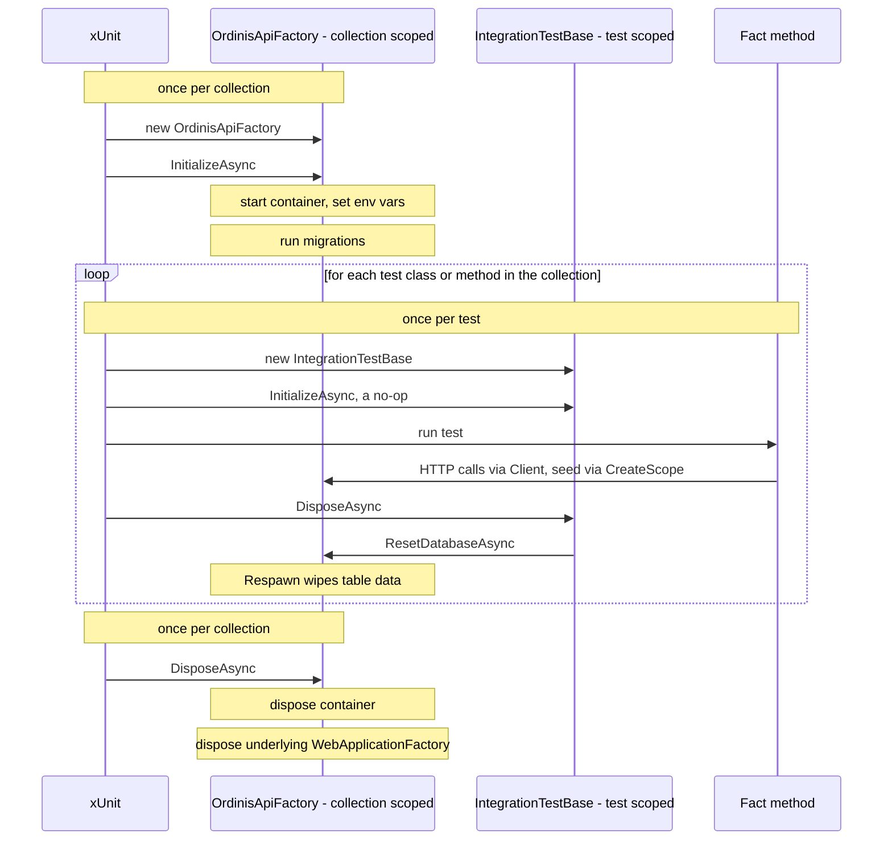

# Integration test infrastructure

`Ordinis.IntegrationTests` boots the real `Ordinis.Api` host in-process and drives it over HTTP
against a real, disposable SQL Server database — not mocks, not SQLite, not EF Core InMemory.
SQLite/InMemory were rejected because they can't faithfully exercise the `RowVersion`
concurrency-token and provider-specific SQL behavior these tests exist to catch.

```
tests/Ordinis.IntegrationTests/
├── Infrastructure/
│   ├── OrdinisApiFactory.cs     # WebApplicationFactory<Program> + SQL Server container lifecycle
│   ├── ApiCollection.cs         # xUnit collection definition — shares one factory across classes
│   └── IntegrationTestBase.cs   # base class every test class inherits from
└── SmokeTests.cs                # verifies the infra itself, not a feature
```

## Packages

| Package | Purpose |
|---|---|
| `Microsoft.AspNetCore.Mvc.Testing` | Provides `WebApplicationFactory<T>` — boots `Ordinis.Api` in-process and exposes an `HttpClient` wired directly to its `TestServer`, so requests never leave the process. |
| `Testcontainers.MsSql` | Starts/stops a disposable `mcr.microsoft.com/mssql/server:2022-latest` Docker container per test run. |
| `Respawn` | Resets table data (not schema) between tests by deleting rows in FK-safe dependency order — far cheaper than re-running migrations or recreating the database per test. |

Running these tests requires **Docker running locally** (and in CI).

## `OrdinisApiFactory`

A `WebApplicationFactory<Program>` that owns one `MsSqlContainer` for its whole lifetime.

- **`Program` visibility.** `Ordinis.Api/Program.cs` uses top-level statements, which don't
  otherwise expose an accessible entry-point type. `public partial class Program;` was added as
  the last line of `Program.cs` purely so `WebApplicationFactory<Program>` can reference it.

- **Config must be injected via environment variables, not `ConfigureWebHost`.**
  `Program.cs` calls `AddInfrastructureServices(builder.Configuration)`, which reads
  `DatabaseProvider` / `ConnectionStrings:DefaultConnection` **synchronously**, before
  `builder.Build()` runs. `WebApplicationFactory`'s `ConfigureWebHost` (and anything registered
  through it, like `ConfigureAppConfiguration`) only attaches once `Build()` is invoked — by then
  `AddInfrastructureServices` has already thrown for the missing connection string. Environment
  variables don't have this problem: `WebApplicationBuilder.CreateBuilder(args)` reads them at
  call time. So `OrdinisApiFactory.InitializeAsync()` sets
  `DatabaseProvider` / `ConnectionStrings__DefaultConnection` / `ASPNETCORE_ENVIRONMENT` as
  process environment variables **before** the host is ever built (i.e. before `Services` or
  `CreateClient()` is first touched).

- **Migrations run for real.** After the container starts, `InitializeAsync()` resolves
  `AppDbContext` from a DI scope and calls `Database.MigrateAsync()` — the same
  `Ordinis.Infrastructure.Migrations.SqlServer` migrations production uses (see
  [MIGRATIONS.md](MIGRATIONS.md)). There is deliberately no `EnsureCreated()` shortcut, so a
  migration that doesn't apply cleanly fails the test run the same way it would fail a real
  deployment.

- **The global rate limiter is disabled for tests.** Production applies a 100 requests/minute
  fixed-window limiter partitioned by client IP (`src/Ordinis.Api/Common/ApiServiceExtensions.cs`).
  Every request from `WebApplicationFactory`'s in-process `TestServer` client shares the same
  loopback partition key, so a test suite firing more than 100 requests in a minute would start
  getting spurious `429`s. `ConfigureTestServices` overrides `RateLimiterOptions.GlobalLimiter` to
  `null` for this factory. A dedicated rate-limiting test (still on the BUILD_PLAN checklist)
  should build its own factory/limiter config instead of relying on this shared instance.

- **`ResetDatabaseAsync()`** wipes table data via Respawn. The `Respawner` is created lazily on
  first use and cached — building it involves introspecting the schema's foreign-key graph to
  compute a safe delete order, so it's done once per factory instance, not once per reset.

## When `ConfigureWebHost` actually runs

`ConfigureWebHost` doesn't run before or after `Program.cs` — it runs **inside** `Program.cs`'s
own call to `builder.Build()`. Understanding the exact timing explains why `ConfigureTestServices`
can override the rate limiter but `ConfigureAppConfiguration` can't fix the connection string.

`WebApplicationFactory<Program>` doesn't execute `Program.cs` as a black box. It invokes
`Program.Main(args)` via reflection (`HostFactoryResolver`), but with a `DiagnosticListener`
subscribed beforehand. `WebApplicationBuilder.Build()` fires a `"HostBuilding"` diagnostic event
partway through its own execution — at that moment, the listener hands the in-progress host
builder to `WebApplicationFactory`, which replays every customization queued via `ConfigureWebHost`
(`ConfigureAppConfiguration`, `ConfigureServices`, `ConfigureTestServices`, ...) against it. Only
after that does `Build()` proceed to construct the actual `IServiceProvider`.



Concretely, the first time `Services` or `CreateClient()` is touched on this factory:

1. `OrdinisApiFactory.InitializeAsync()` sets the environment variables, *then* touches `Services`
   for the first time — that access is what triggers step 2.
2. `Program.Main` starts executing: `WebApplication.CreateBuilder(args)` reads those env vars into
   `builder.Configuration`.
3. `builder.Services.AddInfrastructureServices(builder.Configuration)` runs — reads
   `DatabaseProvider` / the connection string **synchronously, right now** — and
   `AddApiServices()` registers the rate limiter's `Configure<RateLimiterOptions>` delegate. Both
   are just top-level statements executing top-to-bottom like any other code.
4. `builder.Build()` is called. **This is where `ConfigureWebHost` actually runs** — the
   `"HostBuilding"` event fires, and this factory's `ConfigureTestServices` block appends *another*
   `Configure<RateLimiterOptions>` registration to the still-open `IServiceCollection`.
5. `Build()` finishes constructing the `IServiceProvider`. Multiple `IConfigureOptions<T>`
   registrations for the same options type apply in registration order, so the one added last —
   ours — wins and zeroes out `GlobalLimiter`.

**Why this works for the rate limiter but not the connection string:** `Configure<RateLimiterOptions>`
doesn't *do* anything at registration time — it's added to a list replayed later, whenever
something actually resolves `IOptions<RateLimiterOptions>` (on the first request), which is well
after `Build()` completes. Appending one more delegate during step 4 is still plenty early.

`AddInfrastructureServices` doesn't register a deferred `Configure<T>` for the connection string —
it *reads* `configuration["DatabaseProvider"]` and throws immediately, in step 3, before `Build()`
(step 4) even starts. By the time `ConfigureWebHost` gets a chance to run, that line has already
executed and thrown. `ConfigureAppConfiguration` couldn't have fixed this regardless of what it
changed, because it's a step-4 mechanism trying to fix a step-3 problem — which is exactly why
connection info goes through environment variables in step 1, before `Program.Main` even starts,
instead.

**Rule of thumb:** anything Program.cs *reads eagerly* (a plain `configuration[...]` lookup used
immediately, like `AddDatabase`'s validation) must be supplied via environment variables before the
factory is first touched. Anything Program.cs merely *registers* for later resolution (an
`options.Configure<T>` delegate, most DI registrations) can still be overridden through
`ConfigureWebHost`, because DI registrations aren't consumed until something resolves them, and
that always happens after `Build()`.

## Fixture lifecycle

Nothing in this project calls `InitializeAsync()`/`DisposeAsync()` directly — xUnit calls them
automatically as part of its collection-fixture protocol. There are two independent
`IAsyncLifetime` cycles running at different scopes — one around the whole collection, one around
each individual test:



1. Before running the first test in the `"Ordinis API"` collection, xUnit constructs one
   `OrdinisApiFactory` via its parameterless constructor (required by `ICollectionFixture<T>`).
2. Because `OrdinisApiFactory` implements `IAsyncLifetime`, xUnit immediately awaits
   `InitializeAsync()` on it — this is what starts the container, sets the environment variables,
   and runs migrations, all before any test executes.
3. That one initialized instance is injected into every test class constructor tagged
   `[Collection(ApiCollection.Name)]` (i.e. `IntegrationTestBase(OrdinisApiFactory factory)`, and
   transitively every subclass such as `SmokeTests(OrdinisApiFactory factory)`).
4. Each individual test also gets its own `IAsyncLifetime` cycle at the *test* level:
   `IntegrationTestBase.InitializeAsync()` is a no-op, and `DisposeAsync()` calls
   `Factory.ResetDatabaseAsync()` — so xUnit resets the database after every single test, not just
   once per class.
5. After the last test in the collection finishes, xUnit calls `OrdinisApiFactory`'s explicit
   `IAsyncLifetime.DisposeAsync()` once, which disposes the container and the underlying
   `WebApplicationFactory`.

So there are two independent `IAsyncLifetime` implementations in play at different scopes:
`OrdinisApiFactory` (collection-scoped, runs once) and `IntegrationTestBase` (test-scoped, runs
per test). `SmokeTests.cs` exists purely to exercise this whole chain end-to-end — container boot,
migrations, an HTTP round-trip, and the rate-limiter override — as a regression check on the
infrastructure itself, independent of any real feature test.

## `ApiCollection`

```csharp
[CollectionDefinition(Name)]
public sealed class ApiCollection : ICollectionFixture<OrdinisApiFactory>
```

Pure xUnit wiring — no test logic. `ICollectionFixture<OrdinisApiFactory>` tells xUnit to
construct exactly one `OrdinisApiFactory` and hand that same instance to every test class tagged
`[Collection(ApiCollection.Name)]`. This exists because container startup + migrations take
several seconds; without it, every test *class* would pay that cost separately.

Side effect that matters: xUnit runs test *collections* in parallel with each other, but classes
*within* one collection run sequentially. Since every integration test class shares this one
collection, tests never run concurrently against the shared, resettable database — which matters
because `IntegrationTestBase.DisposeAsync()` resets that database after each test.

## `IntegrationTestBase`

The base class every integration test class inherits from:

```csharp
[Collection(ApiCollection.Name)]
public abstract class IntegrationTestBase(OrdinisApiFactory factory) : IAsyncLifetime
```

- `Client` — an `HttpClient` from the shared factory, ready to call.
- `CreateScope()` — opens a DI scope for seeding data directly via `AppDbContext` before a request
  is made.
- `DisposeAsync()` calls `Factory.ResetDatabaseAsync()` after every test, so tests stay independent
  regardless of execution order.

## Writing a new integration test class

```csharp
public sealed class TasksControllerTests(OrdinisApiFactory factory) : IntegrationTestBase(factory)
{
    [Fact]
    public async Task CreateTask_ValidPayload_Returns201()
    {
        // seed via CreateScope() if the test needs existing data, then:
        HttpResponseMessage response = await Client.PostAsJsonAsync("/api/v1/tasks", request);
        Assert.Equal(HttpStatusCode.Created, response.StatusCode);
    }
}
```

No further setup is required — the constructor picks up the shared factory automatically via
xUnit's collection fixture injection.

### Seeding prerequisite data via `CreateScope()`

Most endpoints need rows that already exist — `POST /api/v1/tasks` needs a valid `BoardId`
(and usually a `ReporterId`), so "create a task" can't be tested in isolation. There's no shared
baseline data (deliberately deferred — see `ApiCollection`/`IntegrationTestBase`'s BUILD_PLAN
notes), so each test seeds its own prerequisites directly via EF Core, through `CreateScope()`,
rather than going through other endpoints (e.g. `POST /api/v1/boards`) just to obtain IDs — that
would be slower and would couple this test's correctness to an unrelated endpoint's.

```csharp
[Fact]
public async Task CreateTask_ValidPayload_Returns201()
{
    Guid boardId;
    using (IServiceScope scope = CreateScope())
    {
        AppDbContext db = scope.ServiceProvider.GetRequiredService<AppDbContext>();
        Board board = Board.Create(Guid.CreateVersion7(), projectId, "Sprint Board", createdByUserId, now);
        db.Boards.Add(board);
        await db.SaveChangesAsync();
        boardId = board.Id;
    }

    var request = new CreateTaskRequest { BoardId = boardId, Title = "Fix login bug" };
    HttpResponseMessage response = await Client.PostAsJsonAsync("/api/v1/tasks", request);

    Assert.Equal(HttpStatusCode.Created, response.StatusCode);
}
```

The seeding scope must be disposed (`SaveChangesAsync` called, then the `using` block exited)
**before** the HTTP call — `AppDbContext` is scoped per DI scope, so the controller's own request
pipeline resolves a *separate* `AppDbContext` instance to serve the HTTP call. Only rows already
committed via `SaveChangesAsync` are visible to it.
